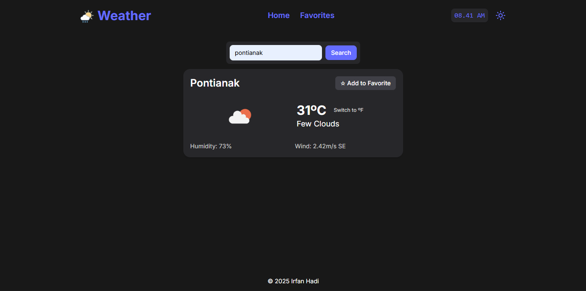
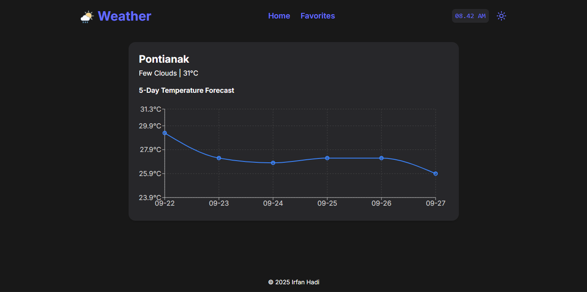

# 🌤️ Weather Dashboard App


Weather Dashboard is a web application that displays real-time weather information for various cities using the [OpenWeather API](https://openweathermap.org/api). It is built with **React**, styled with **Tailwind CSS**, and uses **Redux** with **Async Thunk** for state management and asynchronous data fetching.

🔗 **Live Demo:** [https://bright-cloud.netlify.app/](https://bright-cloud.netlify.app/)

---

## ✨ Features

- 🔍 Search for any city to view current weather conditions
- 🌡️ Display temperature, sky condition, humidity, and wind speed
- 📊 Real-time data from the OpenWeather API
- 🎨 Responsive, modern UI powered by Tailwind CSS
- ⚡ Efficient state management with Redux Toolkit & Async Thunk

---

## 🛠️ Tech Stack

- **Frontend:** [React](https://react.dev/)
- **Styling:** [Tailwind CSS](https://tailwindcss.com/)
- **State Management:** [Redux Toolkit](https://redux-toolkit.js.org/) + Async Thunk
- **API:** [OpenWeather API](https://openweathermap.org/api)
- **Deployment:** [Netlify](https://www.netlify.com/)

---

## 📦 Installation & Setup

Make sure you have **Node.js** installed (latest version recommended).

```bash
# 1. Clone the repository
git clone https://github.com/username/weather-dashboard.git

# 2. Navigate to the project folder
cd weather-dashboard

# 3. Install dependencies
npm install

# 4. Create an .env file for your API key
echo "VITE_WEATHER_API_KEY=your_openweather_api_key" > .env

# 5. Run the development server
npm run dev
```

The app will be available at `http://localhost:5173/` (depending on your Vite configuration).

---

## ⚙️ API Key Configuration

1. Sign up for a free account at [OpenWeather](https://home.openweathermap.org/users/sign_up).
2. Get your API key from the dashboard.
3. Add it to your `.env` file like this:

```env
VITE_WEATHER_API_KEY=your_api_key
```

---

## 📸 Screenshots

### Homepage



### Forecast Page



---

## 🚀 Deployment

This app is deployed on **Netlify**.  
🔗 [https://bright-cloud.netlify.app/](https://bright-cloud.netlify.app/)

---

## 👨‍💻 Author

Created by Irfan Hadi.  
If you find this project useful, please consider giving it a ⭐ on GitHub.
